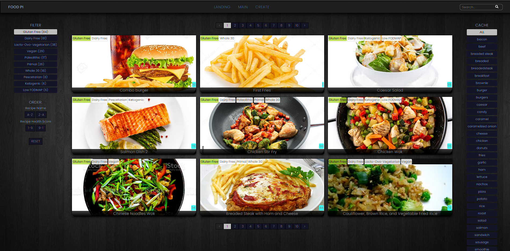

Hi! 👋🏻 My name is Jeronimo, and I am a <b>Full Stack Developer</b> with a marked tendency towards <b>Front End</b>, specially because it combines my biggest two passions: <b>Programming & Graphic Design</b>. 

I’ve been working with JavaScript, React, Redux, NodeJS, Express, Sequelize, PostgreSQL, and Material UI among other technologies.

 
 

<h2 align="left">Some of my Projects:</h2>

 

<h3> PI FOOD </h3>

Single Page Application created as the Individual Project of the soyHENRY's Bootcamp using JavaScript, React-Redux, NodeJS, Express, HTML, CSS, Sequelize, and PostgreSQL, technologies.

  

Main Features: Fetch items from an external API, Create recipes through a controlled form and save them to a local Data Base, Filter by diet types, Order alfabetically or by healthScore, Delete created recipes, and Search through all items.

API: https://www.spoonacular.com/
 
           
<a href="https://github.com/jdcm182/PI-Food-J">
<a href="https://github.com/jdcm182/PI-Food-J">

 
 

<h3> PF MARKETPLACE </h3>
  
Single Page Application created as the Grupal Project of the soyHENRY's Bootcamp using JavaScript, React-Redux, NodeJS, Express, HTML, CSS, Sequelize, PostgreSQL, and Material UI. 

<!---
Main Features: Fetch items from an external API, Create recipes through a controlled form and save them to a local Data Base, Filter by diet types, Order alfabetically or by healthScore, Delete created recipes, and Search through all items.

-->

           
<a href="https://github.com/jdcm182/PF-Henry-PT07G06-FRONT">
<a href="https://github.com/jdcm182/PF-Henry-PT07G06-FRONT">
<a href="https://github.com/jdcm182/PF-Henry-PT07G06-FRONT">
<a href="https://github.com/jdcm182/PF-Henry-PT07G06-FRONT">
<a href="https://github.com/jdcm182/PF-Henry-PT07G06-FRONT">
<a href="https://github.com/jdcm182/PF-Henry-PT07G06-FRONT">

  
   
   
  

<h2 align="left">My GitHub Stats:</h2>
<!--  --->
  
 
 

  
  
   
   

  <h2 align="left"> Technologies I use: </h2>
  

    <table>
      <thead>  <tr> <th colspan="2"> Stack </th> </tr> </thead>
      <tbody>
        <tr>
          <td> Main language </td>
          <td> JavaScript </td>
        </tr>
        <tr>
          <td> Frontend </td>
          <td> React, Redux, HTML 5, CSS 3 </td>
        </tr>
        <tr>
          <td> Backend </td>
          <td> Node JS, Express JS, Sequelize </td>
        </tr>
        <tr>
          <td> Database </td>
          <td> PostgreSQL, SQL </td>
        </tr>
        <tr>
          <td> Version control </td>
          <td> Git </td>
        </tr>
        <tr>
          <td> Project Management </td>
          <td> Scrum </td>
        </tr>
      </tbody>
  </table>
  
   
   
  

<h2 align="left"> Feel free to contact me: </h2>
  

<a href="https://www.linkedin.com/in/jeronimo-cardozo-dev" target="blank">
   
  <!--  LinkedIn profile --->
  </a>

  
  <a href=mailto:jeronimo.cardozo@gmail.com>jeronimo.cardozo@gmail.com</a>
  
  

<!---
- 👋 Hi, I’m @jdcm182
- 👀 I’m interested in ...
- 🌱 I’m currently learning ...
- 💞️ I’m looking to collaborate on ...
- 📫 How to reach me ...
--->
  
<!---
jdcm182/jdcm182 is a ✨ special ✨ repository because its `README.md` (this file) appears on your GitHub profile.
You can click the Preview link to take a look at your changes.
--->
